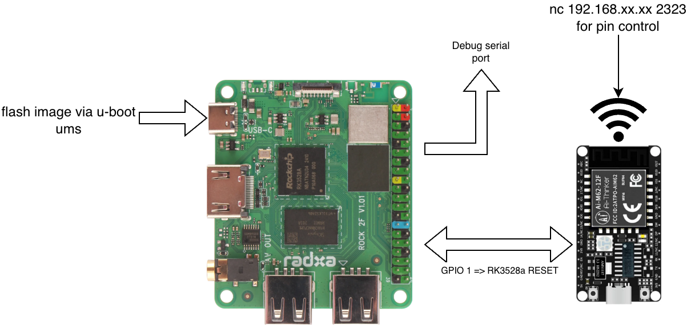

# FreeBSD on RK3528A (Rock 2F)

FreeBSD 移植到 Rockchip RK3528A (Radxa Rock 2F) 的引导固件。

## 目录结构

```
rk3528a-freebsd/
├── u-boot/          # U-Boot v2026.07-rc2 (主线，含 RK3528 支持)
├── rkbin/           # Rockchip 闭源固件 (DDR 初始化, BL31, BL32)
│   └── bin/rk35/    # RK3528 固件二进制文件
└── rk3528_uboot.img # 编译输出：可烧录 TF 卡镜像
```

## 依赖

| 工具 | 说明 |
|------|------|
| `gmake` | GNU Make (BSD make 不兼容) |
| `aarch64-none-elf-gcc` | ARM64 交叉编译器 (`pkg install aarch64-none-elf-gcc`) |
| `python3` | binman 打包需要 |

## 快速开始

### 1. 编译 U-Boot

```bash
cd u-boot

# 配置 (只需首次执行)
gmake rock-2-rk3528_defconfig

# 编译 (自动通过 binman 打包 idbloader.img + u-boot.itb)
gmake CROSS_COMPILE=/usr/local/bin/aarch64-none-elf- HOSTCC=cc \
  ROCKCHIP_TPL=../rkbin/bin/rk35/rk3528_ddr_1056MHz_2L_PCB_v1.11.bin \
  BL31=../rkbin/bin/rk35/rk3528_bl31_v1.20.elf \
  -j$(sysctl -n hw.ncpu)
```

编译产物：

| 文件 | 说明 |
|------|------|
| `u-boot/idbloader.img` | DDR 初始化 + SPL (由 binman 自动生成) |
| `u-boot/u-boot.itb` | U-Boot + ATF BL31 + DTB (FIT 镜像) |

`u-boot.itb` 包含三种板型的 DTB，启动时通过 ADC 自动识别：
- Rock 2A: `rk3528-rock-2a.dtb`
- Rock 2F: `rk3528-rock-2f.dtb`
- Radxa E20C: `rk3528-radxa-e20c.dtb`

### 2. 编译 FreeBSD (可选)

如需从源码编译 FreeBSD world 和内核：

```bash
# 创建独立编译输出目录
mkdir -p freebsd-objs

# 编译 world (用户态工具链)
MAKEOBJDIRPREFIX=$(pwd)/freebsd-objs make -C freebsd-src buildworld \
  TARGET=arm64 TARGET_ARCH=aarch64 -j$(sysctl -n hw.ncpu)

# 编译内核
MAKEOBJDIRPREFIX=$(pwd)/freebsd-objs make -C freebsd-src buildkernel \
  KERNCONF=ROCKCHIP TARGET=arm64 TARGET_ARCH=aarch64 -j$(sysctl -n hw.ncpu)
```

> FreeBSD 源码位于 `freebsd-src/` 子模块。`MAKEOBJDIRPREFIX` 将所有编译产物隔离到 `freebsd-objs/` 目录。

#### 增量编译 (快速调试)

首次全量编译后，日常调试只需修改内核并重编，无需每次重新编译 world：

```bash
# 仅重新编译内核 (增量，跳过已编译目标)
MAKEOBJDIRPREFIX=$(pwd)/freebsd-objs make -C freebsd-src buildkernel \
  KERNCONF=ROCKCHIP TARGET=arm64 TARGET_ARCH=aarch64 \
  -DKERNFAST -DNO_CLEAN -j$(sysctl -n hw.ncpu)
```

| 选项 | 作用 |
|------|------|
| `-DKERNFAST` | 跳过 config、depend 等重复步骤，只编译变化的源文件 |
| `-DNO_CLEAN` | 不执行 `make clean`，保留已有 `.o`，仅重编修改过的文件 |

> **典型调试流程**：首次全量 `buildkernel` → 改内核代码 → 增量 `buildkernel -DKERNFAST -DNO_CLEAN` → 循环。

### 3. 生成 TF 卡镜像

```bash
# 创建空白镜像
dd if=/dev/zero of=rk3528_uboot.img bs=1M count=10

# 写入 idbloader 到 LBA 64 (Rockchip BootROM 约定偏移)
dd if=u-boot/idbloader.img of=rk3528_uboot.img bs=512 seek=64 conv=notrunc

# 写入 u-boot.itb 到 LBA 16384 (SPL 加载偏移)
dd if=u-boot/u-boot.itb of=rk3528_uboot.img bs=512 seek=16384 conv=notrunc
```

### 4. 烧录到 TF 卡

```bash
sudo dd if=rk3528_uboot.img of=/dev/da0 bs=1M conv=fsync
```

> 用 `camcontrol devlist` 查看 TF 卡设备名，将 `/dev/da0` 替换为实际设备。

## 镜像布局

```
LBA        偏移        内容
────────────────────────────────────────
0 - 63     0 - 32KB    保留 (Rockchip vendor 数据区)
64         32KB        idbloader.img (DDR 初始化 + SPL)
16384      8MB         u-boot.itb (U-Boot + BL31 + 3 个 DTB)
```

## 固件版本

| 固件 | 文件 | 版本 |
|------|------|------|
| DDR 初始化 | `rk3528_ddr_1056MHz_2L_PCB_v1.11.bin` | v1.11 |
| ATF BL31 | `rk3528_bl31_v1.20.elf` | v1.20 |
| OP-TEE BL32 | `rk3528_bl32_v1.06.bin` | v1.06 (可选) |

Rock 2F 使用 2 层 PCB，因此 DDR 固件选用 `2L_PCB` 版本。

## 硬件信息



- **SoC**: Rockchip RK3528A (4×Cortex-A53, ARMv8-A)
- **内存映射**: 0x00000000 - 0xFC000000 (最大 4GB)
- **调试串口**: UART0, 1500000-8-N-1
- **MMIO 起始**: 0xFC000000
